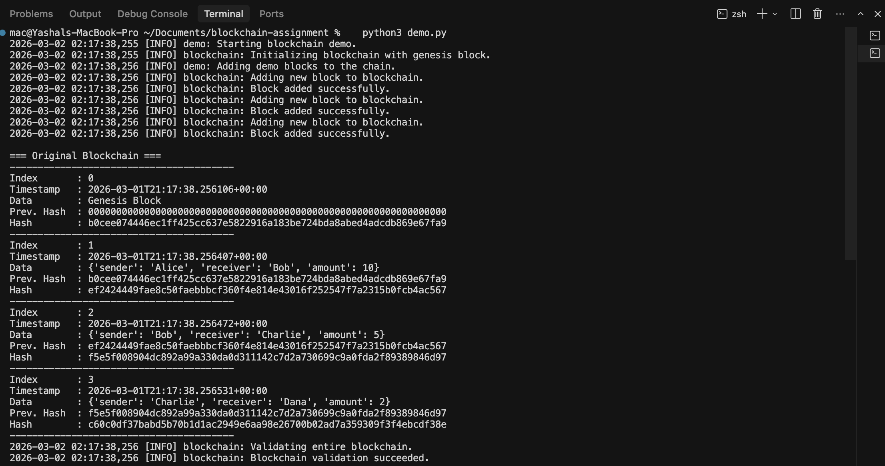
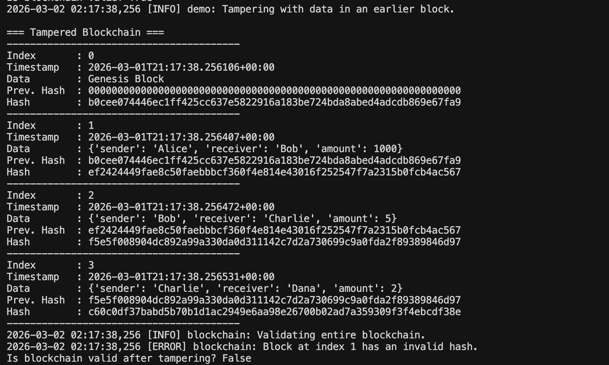
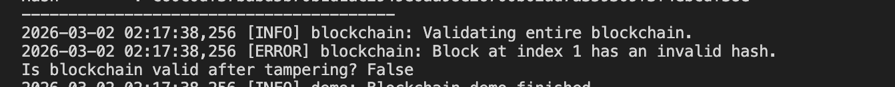

### Assignment Report

#### 1. Design Approach

The goal of this assignment is to implement a minimal, educational blockchain without mining or proof-of-work.

The design therefore focuses on:

* Clarity over complexity – only the essential elements needed to understand block structure, hashing, and validation are implemented.
* Strong separation of concerns – each concept (types, block, chain, demo) is in its own file to keep the code modular and readable.
* Deterministic hashing – the same block content must always produce the same hash.

The project is organized into four main modules:

* blockchain_types.py

This file centralizes basic type aliases such as HashStr, BlockIndex, TimestampStr, and BlockData.

Using a separate file for types avoids repeating primitive types across the project and makes the intent of each field clearer.

* block.py

This file defines the Block class. Each block encapsulates:* index: The position of the block in the chain, starting from 0 for the genesis block.

* timestamp: When the block was created, stored as an ISO 8601 string in UTC.
* data: Arbitrary payload (for example, a simple transaction object).
* previous_hash: The SHA-256 hash of the previous block in the chain.
* hash: The SHA-256 hash of the current block, computed from the other fields.

The Block class is implemented using Python’s dataclass for concise and clear field definitions.

The __post_init__ method automatically calls compute_hash() so that whenever a block is created, its hash is immediately derived from its contents.

Two factory methods simplify block creation:

* Block.create_genesis(data: BlockData | None = None)

Creates the first block in the chain with:* index = 0

* previous_hash set to 64 zeros (a common convention for the genesis block)
* A default data value "Genesis Block" if no data is provided.
* Block.create_next(previous_block: Block, data: BlockData)

Creates a new block:* index = previous_block.index + 1

* previous_hash = previous_block.hash
* timestamp set to the current UTC time.
* blockchain.py

This file defines the Blockchain class, which is responsible for:* Maintaining the in-memory list of blocks.

* Creating the genesis block during initialization.
* Adding new blocks with add_block(data).
* Validating the chain with is_valid().
* Displaying the chain in a human-readable format using pretty_print().

On initialization, the blockchain constructs a list containing exactly one element: the genesis block.

This ensures that the chain is never empty and that all later operations have a well-defined starting point.

* demo.py

This script acts as the main entry point for running the example.

It:* Instantiates a Blockchain.

* Adds three additional blocks with simple transaction-like data.
* Prints the full chain and checks validity.
* Demonstrates tampering and shows validation failure.

Overall, the design mirrors the core ideas used in real blockchain systems—linked blocks, hash-based integrity, and full-chain validation—while remaining compact and easy to understand for educational purposes.

#### 2. Hash Linking Concept

The core security property of a blockchain is that each block is linked to the previous one using a cryptographic hash.

In this implementation, the link is created by including the previous_hash field of a block in the data that is hashed to produce its own hash.

For each block, the compute_hash() method:

1. Creates a dictionary containing:

* index
* timestamp
* data
* previous_hash

1. Serializes this dictionary into a JSON string with deterministic options:

* Keys sorted (sort_keys=True).
* Compact separators to avoid differences in whitespace.

1. Encodes the JSON string to bytes and passes it to hashlib.sha256.
2. Stores the resulting hexadecimal digest as the block’s hash.

Because the previous_hash of a block is equal to the hash of the previous block, the following chain of dependencies is created:

* If any field of block i**i** changes (for example, its data), then the recomputed hash of block i**i** will change.
* Since block i+1**i**+**1** stores the old hash of block i**i** in its previous_hash, the link between block i**i** and block i+1**i**+**1** becomes inconsistent.
* Therefore, a single modification can break the integrity of the entire chain after that point.

This mechanism is what provides data immutability:

any attempt to silently alter past data will cause a mismatch between stored hashes and recomputed hashes during validation.

#### 3. Blockchain Validation Logic

The Blockchain.is_valid() method is responsible for checking the integrity of the whole chain.

It performs several sequential checks:

1. Genesis block checks

* The chain must not be empty.
* The first block must have index == 0.
* The first block must have previous_hash equal to 64 zeros.
* The stored hash of the genesis block must equal the value returned by genesis.compute_hash().

1. Per-block checks for all subsequent blocks

For each block at position i**i** (starting from 1):

* Hash consistency

The stored hash field must be equal to the freshly recomputed hash from compute_hash().

If they differ, it means the block’s contents have been modified without updating the hash.

* Link correctness

The block’s previous_hash must be exactly equal to the hash of block i−1**i**−**1**.

If this link is broken, it indicates that either the current block or the previous block was changed.

* Index sequence

The block’s index must be previous.index + 1.

This ensures that no blocks have been removed, inserted, or reordered.

If any of these checks fail for any block, is_valid() immediately returns False.

Only if all checks pass for the entire chain does the method return True.

This full-chain validation is necessary because the security property of a blockchain depends on the integrity of every link from the genesis block to the latest block.

#### 4. Tampering Demonstration and Result

To demonstrate the effect of tampering, demo.py intentionally modifies the data of an earlier block after the chain has been constructed.

The steps performed in the demo are:

1. Initial chain construction
   

* Create a new Blockchain (with a genesis block).
* Add three blocks:
* Block 1: {"sender": "Alice", "receiver": "Bob", "amount": 10}
* Block 2: {"sender": "Bob", "receiver": "Charlie", "amount": 5}
* Block 3: {"sender": "Charlie", "receiver": "Dana", "amount": 2}
* Print the entire chain.
* Call is_valid(), which returns True.

This confirms that all hashes and previous_hash fields are consistent.

2. Tampering with an earlier block
   

* Directly access the second block in the chain (index 1) and modify its data field:
* From amount: 10 to amount: 1000.
* Note that its stored hash field is not recomputed or updated.

3. Validation after tampering
   

* Print the chain again, now showing the modified data in block 1.
* Call is_valid() a second time.

During the second validation, the algorithm recomputes the hash of block 1 from its new data.

Because the recomputed hash is different from the stored hash value recorded when the block was first created, the validation logic detects a mismatch and reports:

* An error log (for example): “Block at index 1 has an invalid hash.”
* A final result of False from is_valid().

This experiment clearly shows that:

* Simply changing the data of a block, without also updating all dependent hashes, causes the chain to become invalid.
* In a real blockchain with proof-of-work, recomputing all affected hashes would be computationally expensive, which prevents attackers from easily rewriting history.

#### 5. Conclusion

This implementation achieves the main objectives of the assignment:

* It defines a clear block structure with index, timestamp, data, previous_hash, and hash.
* It uses cryptographic hashing (SHA-256) to produce deterministic hashes from block contents.
* It enforces hash chaining by including the previous block’s hash in the data used to compute the current block’s hash.
* It demonstrates data immutability: any change to an earlier block breaks the chain’s integrity.
* It provides a clear validation procedure that checks both hash correctness and previous-hash links.

The accompanying demo script and printed outputs make it easy to observe how the chain behaves before and after tampering, which helps build an intuitive understanding of why blockchains are resistant to unauthorized modifications.

---
